# 1. Representing and Manipulating Information

## 1.1. Integer Arithmetic

### 1.1.1. Unsigned Multiplication

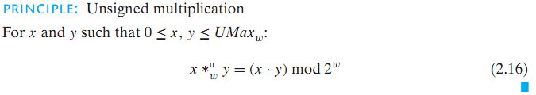

### 1.1.2. Tow's-Complement Multiplication

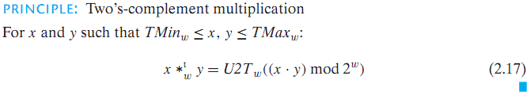

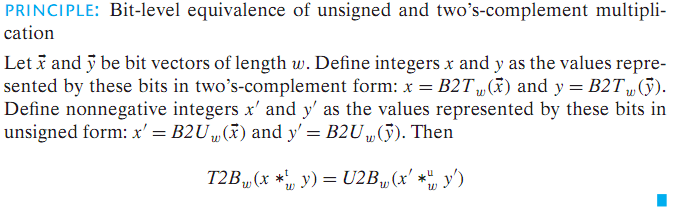

### 1.1.3. Multiplying by Constants

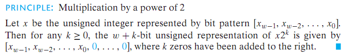

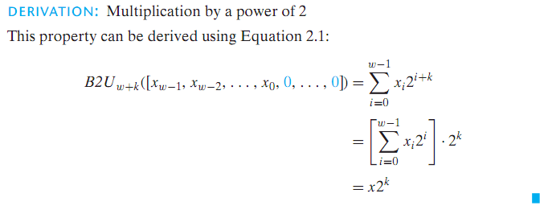

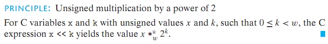

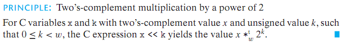

### 1.1.4. Dividing by Powers of 2

Integer division always rounds toward zero.

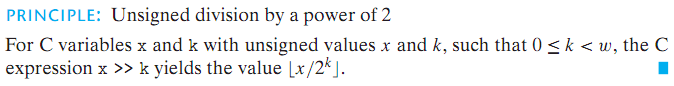

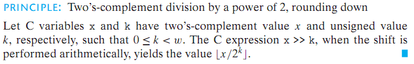

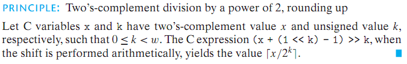

Two's-complement machine using arithmetic right shift, the C expression

```c
(x < 0 ? x + (1 << k) -1 : x) >> k
```

will compute the value $x/2^k$ .

## 1.2. Floating Point

### 1.2.1. IEEE Floating-Point Representation

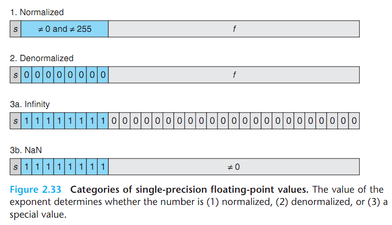

$Bias = 2^{k-1}-1$

- Case 1: Normalized Values

  The exponent value is $E = e - Bias$.

  The significand is defined to be $M = 1 + f$.

- Case 2: Denormalized Values

  The exponent value is $E = 1 - Bias$.

  The significand is defined to be $M = f$.

- Case 3: Special Values

  $+\infty$ when $s = 0$; $-\infty$ when $s = 1$.

### 1.2.2. Rounding

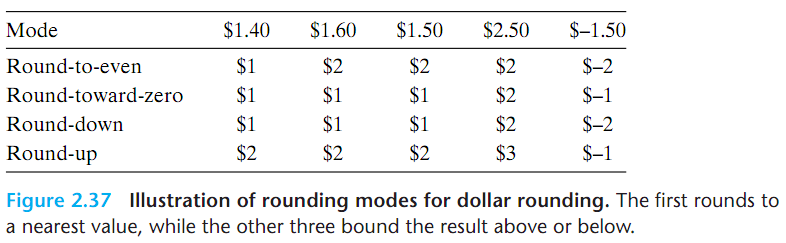

Round-to-even is the default mode.

### 1.2.3. Floating-Point Operations

The lack of associativity in floating-point addition/multiplication is the most important group property that is lacking.

One the other hand, floating-point addition/multiplication satisfies the following monotonicity properties.

### 1.2.4. Floating Point in C

